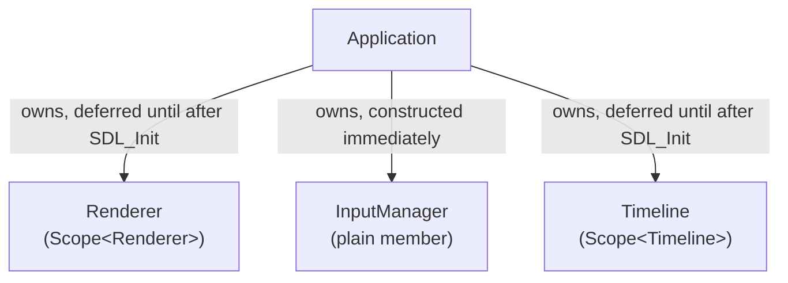

# Application Lifecycle

This page is about *ordering* — what has to happen before what, and why —
rather than the API surface itself (see the
[Application Reference](../reference/application.md)) or the per-frame
mental model (see the [Application Loop concept](../concepts/application-loop.md)).

## Construction order

```cpp
Application::Application(const WindowConfig& windowConfig)
	: m_IsRunning(true)
{
	if (!SDL_Init(SDL_INIT_VIDEO)) { throw std::runtime_error(SDL_GetError()); }

	try
	{
		m_Renderer = CreateScope<Renderer>(windowConfig);
		m_GameTimeline = CreateScope<Timeline>();
	}
	catch (...)
	{
		SDL_Quit();
		throw;
	}
}
```

`SDL_Init(SDL_INIT_VIDEO)` must succeed **first** — both `Renderer` (which
creates an `SDL_Window`/`SDL_Renderer`) and the default-constructed
`Timeline` (whose anchor reads `SDL_GetTicks()`) depend on SDL already being
initialized. If either constructor throws after `SDL_Init` succeeded, the
`catch (...)` block calls `SDL_Quit()` before rethrowing — so a failed
`Application` construction never leaves SDL initialized with nothing to
clean it up.

`InputManager` is *not* part of this try/catch at all — it's a plain member
(not a `Scope<T>`), constructed via its implicit default constructor as part
of the member-initializer list, before the constructor body (and therefore
before `SDL_Init`) even runs. That's safe only because `InputManager`'s
default constructor touches nothing SDL-related — it just zero-initializes
an array.

## Ownership



`Renderer` and `Timeline` are wrapped in `Scope<T>` specifically so their
construction can be *deferred* until after `SDL_Init` succeeds — a plain
member would have to be constructed as part of the initializer list, too
early. `InputManager` doesn't need that deferral, so it isn't wrapped.

## Destruction order — and why it's not left to chance

```cpp
Application::~Application()
{
	m_Renderer.reset();
	SDL_Quit();
}
```

Member destructors normally run automatically, in reverse declaration order,
*after* a class's own destructor body finishes. Left to that default, `SDL_Quit()`
(in the body) would run **before** `m_Renderer`'s automatic destruction —
destroying an `SDL_Window`/`SDL_Renderer` *after* SDL itself has already shut
down. The explicit `m_Renderer.reset()` call exists precisely to force
`Renderer`'s destruction earlier than its natural position, so the real SDL
handles it owns are released while SDL is still alive. `Timeline` holds no
SDL resource directly (nothing in its destructor touches SDL), so it's safe
for it to be destroyed automatically, after `SDL_Quit()`, in the ordinary
reverse-declaration-order pass that follows.

!!! warning "Threading Rule"
    None of this is about threads — `Application` is single-threaded start
    to finish. This section is about *destructor-body-versus-automatic*
    ordering within one thread, which is easy to get backwards without the
    explicit `reset()` call.

## Run lifecycle

`Run()` blocks the calling thread for the entire game, looping until a quit
or window-close event is observed. See the
[Application Loop concept](../concepts/application-loop.md) for the exact
per-frame order. There is no separate shutdown callback — `Run()` simply
returns, and whatever `Application` owns is torn down when the `Application`
object itself goes out of scope afterward.

## A documented intent that code doesn't enforce

`Application`'s class comment describes it as "the one deliberate
engine-singleton-like object" — but nothing in the code actually enforces
that. There's no static instance guard; constructing a second `Application`
would call `SDL_Init` again and create a second independent window. This is
worth knowing precisely because it's a *documented intent*, not a *checked
invariant* — noted here rather than silently assumed away.

## See Also

- [System: Application](../systems/application.md)
- [Reference: Application](../reference/application.md)
- [Concept: Application Loop](../concepts/application-loop.md)
