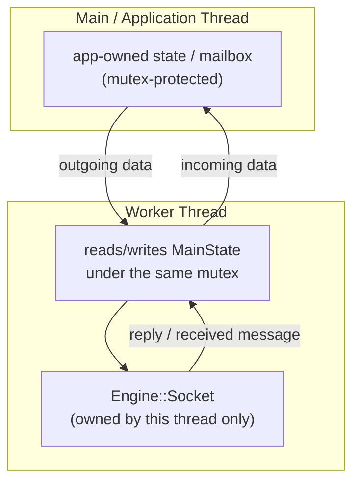

# Networking Threading Model

This page is about one fact and its consequences: **the Engine itself spawns
zero networking threads.** Everything about how many threads exist, who
owns which `Socket`, and how results move between threads is a decision
made entirely outside the Engine.

## The Engine fact

`Socket` is a thread-affine resource, not a worker:

- It has no internal synchronization — no mutex, no atomics, nothing.
- It never creates a thread, never runs a loop in the background, never
  schedules anything for later.
- Every method does exactly the one ZeroMQ operation it names, on whatever
  thread calls it, and returns (or blocks, for `Receive`) on that same
  thread.

There is no "networking subsystem" running anywhere inside the Engine.
`Socket` is exactly as thread-passive as `Entity` or `PhysicsSystem` — a
plain object that does nothing until called.

## Caller responsibility

Because `Socket` has no opinion about threading, every one of these is a
decision the consumer makes, not something the Engine decides for you:

- **How many threads** the application uses for networking at all — zero
  (synchronous, on the main thread), one, or several.
- **Who owns each `Socket`** — exactly one thread, for that socket's entire
  lifetime (see [System: Socket](../systems/networking/socket.md)).
- **Mailbox/mutex design** — how a result a worker thread received gets
  handed back to whatever thread needs it (a game's main thread, typically).
- **Blocking strategy** — whether to call the blocking `Receive()` and
  accept that the calling thread stops until a reply arrives, or poll with
  `TryReceive()` instead.
- **Shutdown strategy** — how to stop a thread that might currently be
  blocked inside `Receive()`.

## A consumer pattern — not a requirement

One common shape, used by this project's own example client
(see [Example: Spare Parts](../examples/spare-parts.md)): the main/game
thread never touches a `Socket` at all. It hands outgoing data to a small
piece of app-owned, mutex-protected state; a dedicated worker thread reads
that state, owns the `Socket` for its entire life, and writes results back
into a second piece of app-owned state the main thread reads later.

Nothing about this diagram is created automatically — it's one pattern a
consumer can choose, built entirely from ordinary `std::thread`/`std::mutex`
and one `Engine::Socket` per worker. **A worker thread is not mandatory.** A
tool that's fine blocking its only thread while it waits for a reply (like
the [Send a Request guide](../guides/send-a-request.md)'s minimal example,
or this repo's own test clients) can call `Socket::Receive()` directly on
its main thread — that's a valid, simpler choice when blocking is
acceptable.

## Why Receive() blocking forever matters for shutdown

`Socket::Receive()` has no timeout. If a worker thread is blocked inside
`Receive()` waiting for a reply, and the peer on the other end never
responds again (crashed, network partition, anything), that thread stays
blocked **indefinitely** — there is nothing in `Socket` that can interrupt
it.

This has a direct, practical consequence for shutdown: if your shutdown
path does `thread.join()` on a worker that might be mid-`Receive()`, that
join can hang forever too. Nothing in the Engine solves this — a consumer
that needs bounded shutdown has to build it itself (a receive timeout
alternative, a way to close the socket from another thread to force the
blocking call to fail, or a protocol-level "goodbye" the peer is trusted to
answer promptly). See
[Example: Spare Parts](../examples/spare-parts.md#known-limitations-example-project-only)
for a concrete case where this exact gap is accepted, not solved.

## Where to go next

[Reference: Socket](../reference/socket.md){: .ge-card__link } →

Exact blocking behavior for every method.

[Example: Spare Parts](../examples/spare-parts.md){: .ge-card__link } →

A real worker-thread-per-socket architecture built on these primitives.

