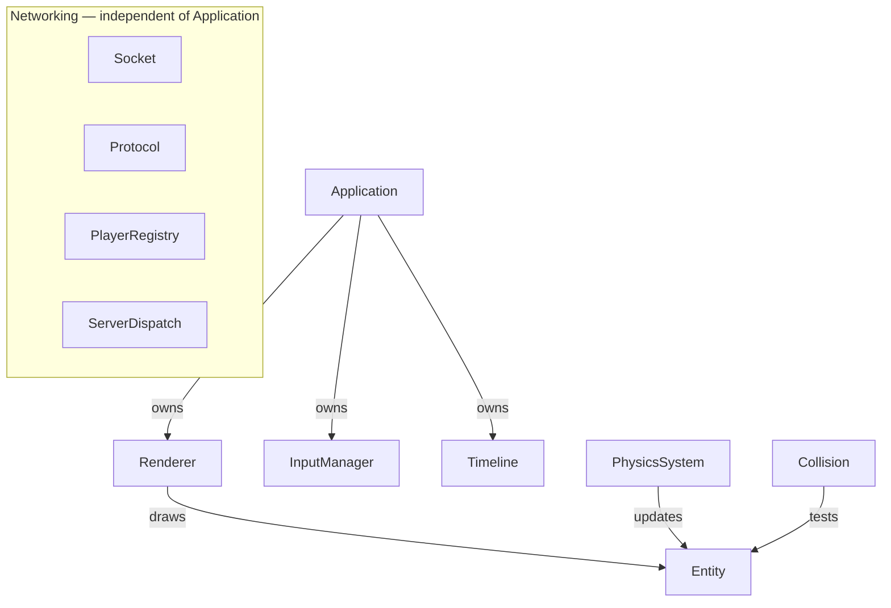
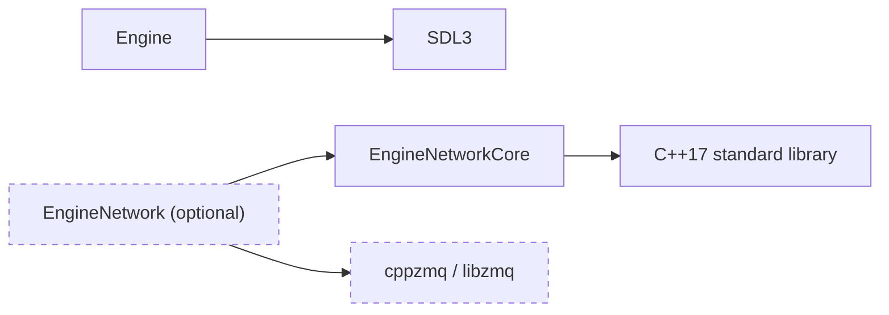

# Architecture Overview

This page gives the whole-engine picture: what the engine actually owns today,
how the pieces compose, where the dependency boundaries sit, and — critically
— where the engine ends and a real game begins. It is the one full
architecture page in this documentation pass; individual system pages arrive
later.

## Engine / Game boundary

!!! tip "The engine/game boundary is structural, not a convention"
    `Engine` is built as its own static library. A game links it as a
    dependency, from its own repository — reusable code physically cannot
    hide inside one game, and game-specific logic physically cannot leak
    into the engine. This repository builds and tests the engine and
    nothing else: there is no game target here (see
    [Build & Run](../getting-started/build-and-run.md)).

Engine (this repository)

Application &middot; Renderer &middot; Entity &middot; PhysicsSystem &middot;
InputManager &middot; Collision &middot; Timeline &middot; Protocol &middot;
PlayerRegistry &middot; ServerDispatch &middot; Socket

Spare Parts (a separate repository)

The <code>Game</code> class, <code>NetworkClient</code>,
<code>PeerClient</code>, <code>server_main</code>, the moving-platform game
rule, and its own message-rate policy — all game-specific, all built on top
of the engine, none of it documented here.

Nothing on this page describes Spare Parts' internals as if it were core
engine architecture — where a design decision (e.g. a networking topology)
actually lives in the game layer, it's named as such.

## Major engine systems

| System | Header | One-line purpose |
|---|---|---|
| Core | `Engine/Core/Core.h` | Ownership aliases (`Scope`/`Ref`), `Vector2`, `ENGINE_ASSERT` |
| Application | `Engine/Core/Application.h` | Owns the SDL lifecycle and the main update/render loop |
| Renderer | `Engine/Renderer/Renderer.h` | Window + drawing, constant/proportional scaling |
| Entity | `Engine/Entity/Entity.h` | Generic position/size/color/velocity object |
| Physics | `Engine/Physics/PhysicsSystem.h` | Configurable-gravity integration |
| Input | `Engine/Input/InputManager.h` | Polled keyboard state |
| Collision | `Engine/Collision/Collision.h` | Strict AABB overlap test |
| Time | `Engine/Time/Timeline.h` | Logical time: scale, pause, tic size |
| Networking | `Engine/Network/*.h` | Wire protocol, dispatch logic, a thread-affine socket wrapper |

## Ownership, at a high level

- **`Application`** is constructed by the game after SDL video initialization
  succeeds, and owns `Renderer`, `InputManager`, and `Timeline` for its
  entire lifetime (`Scope<Renderer>`, a plain `InputManager` member,
  `Scope<Timeline>`). Its destructor explicitly tears `Renderer` down before
  `SDL_Quit()` runs.
- **`Renderer`** owns the raw `SDL_Window*`/`SDL_Renderer*` handles via RAII
  and is neither copyable nor movable — there is exactly one owner, always.
- **`Entity`**, **`PhysicsSystem`**, and **`Collision`** hold no ownership
  relationship to each other at all: `PhysicsSystem` and `IsColliding` both
  just *operate on* whatever `Entity` a caller passes in. Nothing here owns
  an `Entity` — that's a game-layer decision.
- **Networking types carry no thread of their own.** `Socket` is a
  thread-affine resource wrapper, not a worker — see the System Contract
  below. Every worker-thread pattern in this project's actual networking
  (a client thread, a server session thread) is built *on top of* `Socket`
  in the game layer, not inside the engine.

Networking is drawn separately on purpose: nothing above owns a `Socket`,
and `Application` never touches the networking headers at all.

## Dependency tiers and external boundaries

Three CMake targets, each with a different dependency footprint:

| Target | Depends on | Availability |
|---|---|---|
| `Engine` | SDL3 | Always required |
| `EngineNetworkCore` | C++17 standard library only | Always available |
| `EngineNetwork` | cppzmq → libzmq, plus `EngineNetworkCore` | **Optional** — skipped if cppzmq isn't found |

The dashed nodes are the ones that can be entirely absent from a build: a
machine without cppzmq installed still gets a fully working `Engine` and
`EngineNetworkCore` — only `EngineNetwork` (the ZeroMQ transport) is skipped.

## Where networking fits

Networking splits along exactly that same optional/always-available line:

- **`Protocol`, `PlayerRegistry`, `ServerDispatch`** (in `EngineNetworkCore`)
  are pure C++ — a wire format and server-side dispatch logic with no
  transport dependency at all. They're fully unit-testable without ZeroMQ
  ever being installed.
- **`Socket`** (in `EngineNetwork`) is the one piece that actually depends on
  ZeroMQ — a thin RAII wrapper restricted to `SocketRole::Request` /
  `Reply` / `Publish` / `Subscribe`.

The engine deliberately stops there. It does not itself define a client, a
server, or a networking topology — those are game-layer decisions (Spare
Parts' bootstrap/dedicated-session/peer-to-peer design, for instance),
built by composing these primitives, not by extending them.

## System Contract: a reusable pattern

Every future system page will open with a compact **System Contract** panel
— the facts a caller needs before writing a line of code, not prose. Here it
is demonstrated once, on the engine's highest-stakes threading contract:

System Contract — Socket

<dl>
<dt>Purpose</dt>
<dd>Thin RAII wrapper over one ZeroMQ context + socket, restricted to <code>SocketRole::Request</code> / <code>Reply</code> / <code>Publish</code> / <code>Subscribe</code>.</dd>

<dt>Owner</dt>
<dd>Whichever function/thread constructs it. The class itself has no opinion beyond RAII — it does not assume a particular owner.</dd>

<dt>Thread Affinity</dt>
<dd>Single thread only. A <code>Socket</code> must be created, used, and destroyed on exactly one thread — matching cppzmq's own contract (a <code>zmq::context_t</code> may be shared across threads; a <code>zmq::socket_t</code> may not).</dd>

<dt>Blocking Behavior</dt>
<dd><code>Receive()</code> blocks until a message arrives. <code>TryReceive()</code> never blocks — it uses <code>ZMQ_DONTWAIT</code> and returns <code>std::nullopt</code> if nothing is available yet. <code>Bind</code>/<code>Connect</code>/<code>Send</code> return promptly.</dd>

<dt>Copy / Move Semantics</dt>
<dd>Neither copyable nor movable. Copy is explicitly deleted, which also suppresses the implicit move.</dd>

<dt>Stateful</dt>
<dd>Yes — one context, one socket, one fixed role for the object's entire lifetime.</dd>

<dt>External Dependencies</dt>
<dd>ZeroMQ, via cppzmq. Part of the optional <code>EngineNetwork</code> target.</dd>

<dt>Lifetime</dt>
<dd>RAII. The destructor closes the socket and terminates the context — there is no separate <code>Close()</code>/<code>Shutdown()</code> call.</dd>

<dt>Public Entry Points</dt>
<dd><code>Bind</code>, <code>Connect</code>, <code>Disconnect</code>, <code>Subscribe</code>, <code>Send</code>, <code>Receive</code>, <code>TryReceive</code>.</dd>

<dt>Known Limitations / Failure Modes</dt>
<dd>A blocking <code>Receive()</code> with no responding peer blocks forever — there is no receive timeout inside <code>Socket</code> itself. Every operation throws <code>zmq::error_t</code> on genuine failure; <code>TryReceive()</code> is the one method that reports "nothing yet" as <code>std::nullopt</code> rather than an exception.</dd>

</dl>

!!! warning "Threading Rule"
    Never share one `Socket` instance across threads — not even for reads.
    This is the single most important rule in the networking layer, and it
    is exactly why every real client/server implementation built on top of
    `Socket` in this project dedicates one thread per socket rather than
    trying to synchronize access to a shared one.

!!! tip "Important"
    `EngineNetworkCore` (protocol + registry + dispatch) has **zero**
    dependency on `Socket` or ZeroMQ. You can unit-test an entire
    request/reply exchange without a real socket ever existing.

## Where to go deeper

Two systems now have a full documentation slice — Concepts, System page,
API Reference, and their own Architecture page:

[Application Lifecycle](application-lifecycle.md){: .ge-card__link } →

Construction/destruction order, and why Renderer must be destroyed before <code>SDL_Quit()</code>.

[Timeline Ownership & Sampling](timeline-ownership-and-sampling.md){: .ge-card__link } →

Parent/child composition, anchor sampling order, and the pending-delta mechanism.

Everything else on this page still describes today's *whole-engine* picture;
per-system depth arrives one slice at a time.
