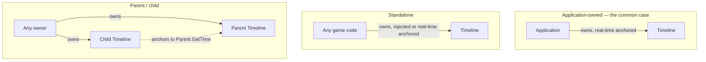

# Timeline Ownership & Sampling

This page covers how `Timeline` instances get owned and composed in
practice, and the internal reasoning behind the sampling behavior described
conceptually in [Logical Time](../concepts/logical-time.md). It's about
*implementation-level reasoning*, not a line-by-line walk through the code.

## Ownership is always external

`Timeline` has no opinion about who owns it — it's a plain value type with
no resource to manage. Three usage shapes exist side by side in this
codebase:

`Application` owning one real-time-anchored `Timeline` (**A**) is the only
shape this engine's own code currently exercises — `Timeline`'s test-seam
constructor (**B**, an injected `AnchorSource`) and parent/child composition
(**C**) are both real, supported capabilities that nothing in this codebase
happens to use yet beyond the test suite.

## The anchor source model

Every `Timeline` is built around one `AnchorSource` — `std::function<double()>` —
supplied once at construction and never changed afterward. The three
constructors just supply three different anchor sources:

- the default constructor supplies a real-time source (`SDL_GetTicks()`)
- the `AnchorSource` constructor takes an arbitrary caller-supplied one — the
  seam that makes deterministic testing possible
- the parent-`Timeline` constructor supplies `[&parent]() { return parent.GetTime(); }`

That last one is the important subtlety: a child's anchor is the parent's
**logical** time, not the parent's own anchor. The parent's scale, tic size,
and pause state are already baked into whatever `GetTime()` returns, so the
child inherits all of it automatically without knowing any of those exist.

## Why the parent must be sampled first

Because a child's anchor source calls `parent.GetTime()` — a pure getter —
sampling the child does nothing to advance the parent. If a per-frame update
samples the child before ever calling the parent's own `GetDeltaTime()` that
cycle, the child observes whatever the parent's logical time was as of the
*previous* cycle, not the current one. This is a real ordering requirement,
not a defensive suggestion — every parent/child test in
`Tests/TimelineTest.cpp` samples the parent first for exactly this reason.

## One shared flush point governs every rate change

`GetDeltaTime()`, `Pause()`, `SetScale()`, and `SetTicSize()` all funnel
through the same private helper (conceptually: "advance to now"), which:

1. Samples the anchor.
2. If paused, re-anchors without accumulating anything (elapsed anchor time
   while paused is discarded).
3. Otherwise, computes `anchorDelta × scale ÷ ticSize` using whatever
   scale/tic size were in effect *before* this call, and credits it to both
   the running total and a pending-delta buffer.
4. Re-anchors to the sample just taken.

Because `SetScale()`/`SetTicSize()` call this *before* adopting the new
value, and `Pause()` calls it *before* setting the paused flag, every one of
these four entry points is guaranteed to flush any unsampled interval at
whatever rate was actually in effect while it elapsed — there's no way for
one of them to accidentally skip the flush, because they all go through the
same code path rather than four independent implementations that could
drift out of sync with each other.

## Pending delta: why nothing gets lost

`GetDeltaTime()` doesn't just read the running total — it drains a separate
pending-delta buffer that the shared flush point (above) writes into. This
is what makes it safe for `SetScale()`/`Pause()` to flush a delta that
*nobody asked for yet*: it isn't discarded, it's queued, and the next
`GetDeltaTime()` call delivers it — even if zero further anchor time has
elapsed by then.

## Pause/unpause re-anchoring is asymmetric, on purpose

`Pause()` goes through the shared flush point (so anything unsampled is
credited before freezing). `Unpause()` does **not** — it directly clears the
paused flag and re-anchors to the current anchor sample. It doesn't need the
shared flush logic: while paused, that logic's only job would have been to
re-anchor-and-discard anyway, which is exactly what directly re-anchoring
already accomplishes, without the awkwardness of clearing the paused flag
first just to make the shared path take its "still paused" branch.

## Ownership vs. synchronization

Nothing above is thread synchronization — it's single-threaded sequencing
*within* whichever thread owns a given `Timeline` (see the
[Reference page's thread-safety note](../reference/timeline.md#thread-safety)).
A parent/child relationship is a same-thread composition tool, not a
cross-thread one; sharing one `Timeline` — parent, child, or standalone —
across threads is outside what this class supports.

## See Also

- [System: Time](../systems/time.md)
- [Concept: Logical Time](../concepts/logical-time.md)
- [Reference: Timeline](../reference/timeline.md)
