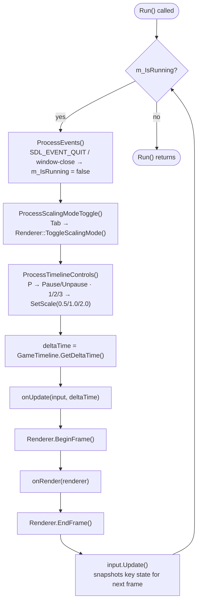

# Application Loop

This is the mental model for what happens between constructing an
`Application` and your game ending. If you've written any SDL game loop by
hand before, this will look familiar — `Application` just does it once,
correctly, so you don't repeat it.

## The shape of it

Construction does the one-time setup: SDL initializes, a window opens, a
`Renderer`, an `InputManager`, and a `Timeline` come into existence. None of
that repeats.

`Run()` is where everything else happens, once per frame, for as long as the
game runs:

1. **SDL events are processed.** Closing the window or requesting quit is
   the only thing that can end the loop.
2. **Two built-in debug-key checks run** — a scaling-mode toggle, and
   Timeline pause/scale controls (see below).
3. **The game timeline is sampled** for this frame's `deltaTime`.
4. **Your update callback runs**, given the input source and that
   `deltaTime`.
5. **Your render callback runs**, between a begin-frame and an end-frame
   call.
6. **Input state is snapshotted** for next frame's "just pressed" detection.

Then it repeats, from step 1, until the loop condition becomes false.

## Where your code fits

`Application` never touches `PhysicsSystem`, `Entity`, `Collision`, or
anything else your game defines — it doesn't know they exist. Your update
callback is *entirely* responsible for driving them:

```cpp
[](Engine::InputManager& input, float deltaTime)
{
	// Your game's own systems run here — Application has no idea what
	// PhysicsSystem, Entity, or Collision even are.
	myPhysics.Update(myPlayer, deltaTime);
}
```

`deltaTime` here is **not a fixed timestep** — it's whatever real time
elapsed since the last frame (subject to whatever `Timeline` scale/pause is
currently in effect), uncapped. There is no fixed-step accumulator anywhere
in `Application`.

## Event processing

SDL events are drained once per frame. The only ones `Application` itself
reacts to are quit and window-close — both simply stop the loop. Anything
else your game cares about (a key being held, a key just pressed) comes
through `InputManager`, not through the SDL event queue directly.

## The two built-in debug keys

Before your callbacks ever run, `Application` checks two of its own key
bindings:

- **Tab** toggles the renderer's scaling mode.
- **P** toggles Timeline pause; **1**/**2**/**3** set Timeline scale to
  0.5×/1×/2×.

These exist so a game gets Timeline-scale/pause debugging for free. See the
[Pause & Slow Motion guide](../guides/pause-and-slow-motion.md) for how to
trigger the same behavior from your own code instead of these keys.

## Timeline sampling

`deltaTime` is produced by exactly one call: `GameTimeline.GetDeltaTime()`.
This happens *after* the debug-key checks above, so if a frame both changes
Timeline's scale (via key **1**/**2**/**3**) and samples it, the new scale is
already in effect for that same frame's delta — see
[Logical Time](logical-time.md) for exactly why that ordering doesn't
retroactively reinterpret anything.

## Input update ordering

`InputManager::Update()` — the call that snapshots key state for next
frame's `IsKeyJustPressed` — runs **last**, after both your update and
render callbacks. This means every "just pressed" check made anywhere during
a frame (the built-in debug keys, and anything your update callback checks)
reads the *same* snapshot: the one taken at the end of the *previous* frame.

## Frame loop exit

The loop's only exit condition is its own running flag, which only
`ProcessEvents()` can clear (on a quit/window-close event). `Run()` then
returns normally — there's no separate "shutdown" callback; anything your
game needs to clean up happens after `Run()` returns, in your own code.

## The actual order, exactly



## Where to go next

<div class="ge-card-grid" markdown>

<div class="ge-card ge-card--linked" markdown>
<p class="ge-card__title" markdown>[System: Application](../systems/application.md){: .ge-card__link } <span class="ge-card__arrow">→</span></p>
<p class="ge-card__purpose">What it owns, what it doesn't, and its System Contract.</p>
</div>

<div class="ge-card ge-card--linked" markdown>
<p class="ge-card__title" markdown>[Reference: Application](../reference/application.md){: .ge-card__link } <span class="ge-card__arrow">→</span></p>
<p class="ge-card__purpose">Exact signatures for the constructor, <code>Run</code>, and the callback types.</p>
</div>

<div class="ge-card ge-card--linked" markdown>
<p class="ge-card__title" markdown>[Architecture: Application Lifecycle](../architecture/application-lifecycle.md){: .ge-card__link } <span class="ge-card__arrow">→</span></p>
<p class="ge-card__purpose">Why construction/destruction order matters, and what happens if it fails.</p>
</div>

</div>
