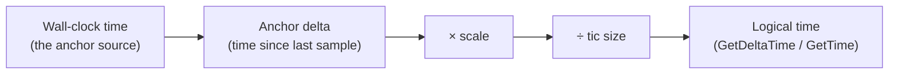
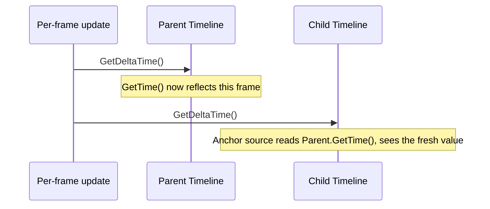

# Logical Time

Timeline separates a game's own logical time from wall-clock time. This page
explains exactly how one becomes the other, and the handful of rules that
make pausing and rate-changing behave the way you'd expect instead of
silently corrupting elapsed time.

## The pipeline



In one line, the exact formula `Timeline` computes every time it samples its
anchor:

```
logicalDelta = anchorDelta × scale ÷ ticSize
```

- **Scale** is a speed multiplier: `0.5` runs at half speed, `1.0` tracks the
  anchor one-to-one, `2.0` runs at double speed.
- **Tic size** is a *unit conversion*, not a speed multiplier: it says how
  much anchor time one logical time unit represents. A tic size of `2.0`
  means logical time needs twice as much anchor time to advance by one unit
  — which happens to also *look* like half speed, but it's a conceptually
  different knob (useful if you ever want "one tic = one fixed-size chunk of
  time" bookkeeping separate from a speed multiplier).

## GetTime() vs. GetDeltaTime()

These sound similar but do very different things:

- **`GetTime()`** is a pure getter. It returns the running total and never
  samples the anchor or changes any state — call it as many times as you
  like, it never affects future readings.
- **`GetDeltaTime()`** actively samples the anchor, credits whatever
  newly-elapsed anchor time it finds into the running total, and returns
  *only* that newly-elapsed amount. Call it twice in a row and the second
  call returns however much *more* time has passed since the first call —
  never the cumulative total.

## Pause and Unpause

`Pause()` freezes logical time: `GetDeltaTime()` reports `0` on every call
while paused, no matter how much real time passes. `Unpause()` resumes from
exactly where it left off — the time that passed *while* paused is
discarded, not deferred, so there is never a catch-up jump when you unpause.

## Why a rate change never rewrites history

This is the one rule worth understanding precisely: **changing scale or tic
size only ever affects anchor time sampled *after* the change.** Any anchor
time that already elapsed — but hadn't been sampled by `GetDeltaTime()` yet
— is credited at the *old* rate first, before the new rate takes effect.

Concretely, changing scale from 1.0 to 2.0:

| Step | Anchor time | What happens | `GetTime()` afterward |
|---|---|---|---|
| 1 | 0 | `Timeline` constructed, scale = 1.0 | 0 |
| 2 | 1 | *(anchor advances; nothing has sampled it yet)* | — |
| 3 | 1 | `SetScale(2.0)` is called | **1** — the already-elapsed unit is credited at the *old* scale (1.0) before the new scale is adopted |
| 4 | 2 | `GetDeltaTime()` is called | **3** — the new, one-unit interval is credited at the *new* scale (2.0), adding 2 |

If scale changes retroactively reinterpreted already-elapsed time instead,
step 3 would have produced `2` (the same one anchor unit, but now read at the
new 2.0 scale) — silently inflating time that already happened. `Timeline`
never does this.

!!! note
    The interval flushed by a `SetScale()`/`SetTicSize()`/`Pause()` call is
    never lost, either — it's held in a small pending buffer and delivered
    on the *next* `GetDeltaTime()` call, even if no further anchor time has
    elapsed by then.

## Parent Timelines: sampling order matters

A `Timeline` can anchor to another `Timeline`'s logical time instead of the
wall clock — this is how pausing or scaling a parent automatically
propagates to every child, while each child can still layer its own
additional scale on top.

The child's anchor source is literally the parent's `GetTime()` — a pure
getter, remember, with no side effect on the parent. That means **the parent
must have its own `GetDeltaTime()` called first, each cycle, or the child
observes a stale value**:



Sample the child before the parent in the same cycle, and it will observe
whatever the parent's logical time was *as of the last time the parent was
sampled* — not the current frame's.

## Where to go next

<div class="ge-card-grid" markdown>

<div class="ge-card ge-card--linked" markdown>
<p class="ge-card__title" markdown>[System: Time](../systems/time.md){: .ge-card__link } <span class="ge-card__arrow">→</span></p>
<p class="ge-card__purpose">What Timeline controls, what it doesn't, and its System Contract.</p>
</div>

<div class="ge-card ge-card--linked" markdown>
<p class="ge-card__title" markdown>[Reference: Timeline](../reference/timeline.md){: .ge-card__link } <span class="ge-card__arrow">→</span></p>
<p class="ge-card__purpose">Exact API, including input validation for scale/tic size.</p>
</div>

<div class="ge-card ge-card--linked" markdown>
<p class="ge-card__title" markdown>[Architecture: Timeline Ownership & Sampling](../architecture/timeline-ownership-and-sampling.md){: .ge-card__link } <span class="ge-card__arrow">→</span></p>
<p class="ge-card__purpose">How this composes across parent/child Timelines in practice.</p>
</div>

</div>
