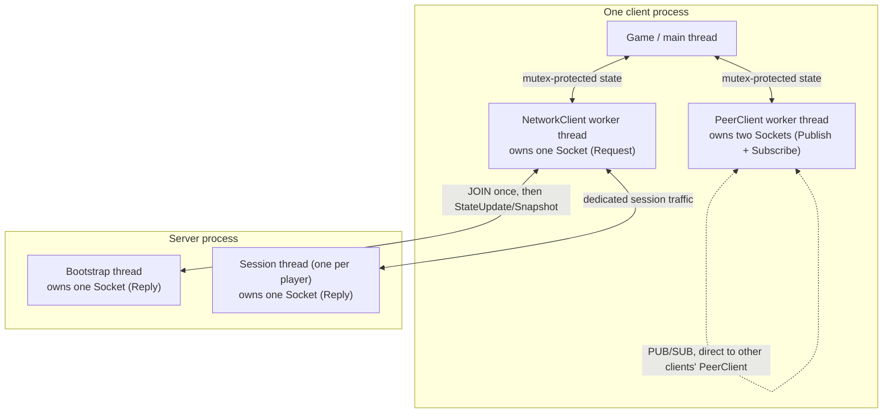
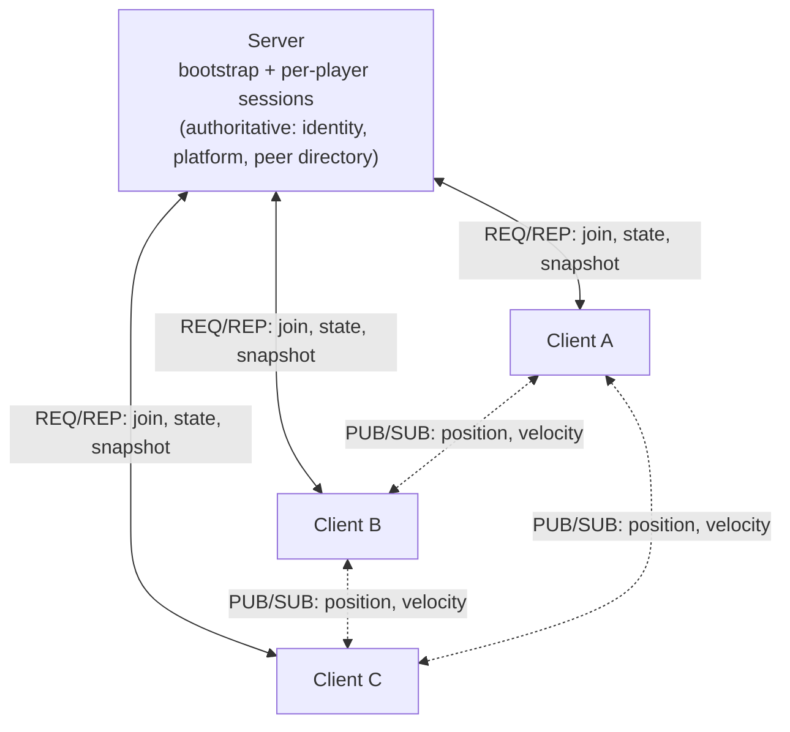

# Example: Spare Parts

!!! warning "Example Project — not Engine API"
    Everything on this page describes **Spare Parts**, a separate
    repository that links the Engine — not a feature of the Engine itself.
    It is documented here as one possible way to compose Engine's
    networking primitives, not as a topology every consumer must follow.
    Nothing here is reachable through, or required by, `Protocol`,
    `PlayerRegistry`, `ServerDispatch`, or `Socket`.

## What's Engine, what's Spare Parts

Engine (reusable)

<code>Protocol</code> &middot; <code>PlayerRegistry</code> &middot;
<code>ServerDispatch</code> &middot; <code>Socket</code>

Spare Parts (this example only)

<code>NetworkClient</code> &middot; <code>PeerClient</code> &middot;
<code>server_main</code>'s topology &middot; its port allocators &middot;
its refresh/publish rates &middot; its platform motion rule

## Server: bootstrap + dedicated sessions

One process, one bootstrap `Reply` socket that accepts only `JOIN`. On a
successful join, bootstrap allocates a dedicated session port and a
peer-to-peer port from two small fixed pools, assigns a `PlayerId` via a
shared `PlayerRegistry`, and spawns a dedicated session thread — then
replies `JoinAccepted` with all three. Every subsequent exchange for that
player happens on its own dedicated `Reply` socket, on its own thread,
completely independent of every other player's session and of bootstrap
itself.

The server also owns two pieces of shared, server-authoritative state that
`ServerDispatch` itself knows nothing about:

- **A moving platform**, computed as a pure function of elapsed real time —
  every session thread computes the same trajectory independently, with no
  platform thread or mutex needed.
- **A peer directory** (`PlayerId → P2P port`), added to on a successful
  join and pruned by a session on its own valid leave.

Because `Engine::HandleSessionRequest` always encodes a neutral, all-zero
`PlatformState` and an empty `Peers` list (it has no concept of either),
the server's own code decodes each reply, overwrites those two fields with
the real values, and re-encodes — a small, explicit fix-up applied once per
reply, entirely outside the Engine.

## Client: NetworkClient + PeerClient

Two separate worker-thread objects, each owning its own `Socket` for its
entire lifetime — the main/game thread never touches ZeroMQ directly and
never blocks on network I/O:

- **`NetworkClient`** — talks to the server. A worker thread performs the
  bootstrap `JOIN`/`JoinAccepted` handshake once, then loops sending
  `StateUpdate` and receiving `Snapshot` on its dedicated session socket.
- **`PeerClient`** — talks directly to other players. A worker thread owns
  one `Publish` socket (broadcasting this player's own state) and one
  `Subscribe` socket (receiving every other connected peer's state),
  reconciling which peers to connect to as the server's peer directory
  changes.

## Hybrid ownership

- **Server-authoritative**: identity (`PlayerId` assignment), membership
  (who's in the roster), the shared moving platform, and peer discovery
  (who's reachable where).
- **Peer-to-peer**: every remote player's actual position/velocity —
  `Snapshot.Roster` is presence data only from `NetworkClient`'s callers'
  point of view; `PeerClient` is the sole source of remote player motion.

## Thread model

## Topology at a glance

Solid lines are the REQ/REP path to the server (identity, membership, the
shared platform, peer discovery). Dashed lines are the direct PUB/SUB path
between clients (remote player position/velocity) — the server never
relays a single byte of this traffic; it only ever tells clients how to
reach each other.

## One possible architecture, not a requirement

Nothing about `Protocol`, `PlayerRegistry`, `ServerDispatch`, or `Socket`
requires this shape. A different consumer could use a single process with
no threads at all (see the [Send a Request guide](../guides/send-a-request.md)),
a different port-allocation scheme, or skip peer-to-peer entirely and route
everything through the server. This page documents one working choice, not
the only one.

## Known limitations (example project only)

These are Spare Parts' own accepted gaps — not Engine limitations:

- **A crashed client can leave a server session permanently blocked.** With
  no heartbeat or receive timeout, a session thread whose client vanished
  without sending `Leaving = true` stays blocked in `Receive()` forever,
  and that player's registry entry, peer-directory entry, session port, and
  P2P port all remain permanently occupied.
- **No reconnect or timeout layer** exists on either the client or server
  side — a lost connection is simply never recovered.

Compare with the Engine-level limitations on
[System: Socket](../systems/networking/socket.md) (no receive timeout is a
property of `Socket` itself) and
[Architecture: Networking Threading Model](../architecture/networking-threading-model.md#why-receive-blocking-forever-matters-for-shutdown)
(why this exact gap exists) — Spare Parts simply hasn't built a layer on
top to close it, which the Engine was never going to do for it.

## Where to go next

[System: Networking Overview](../systems/networking/index.md){: .ge-card__link } →

The primitives this example composes.

[Architecture: Networking Threading Model](../architecture/networking-threading-model.md){: .ge-card__link } →

Why a worker-thread-per-socket pattern is one option, not a requirement.

[System: Server Dispatch](../systems/networking/server-dispatch.md){: .ge-card__link } →

Why PlatformState/Peers arrive neutral from ServerDispatch, and get filled in here.

